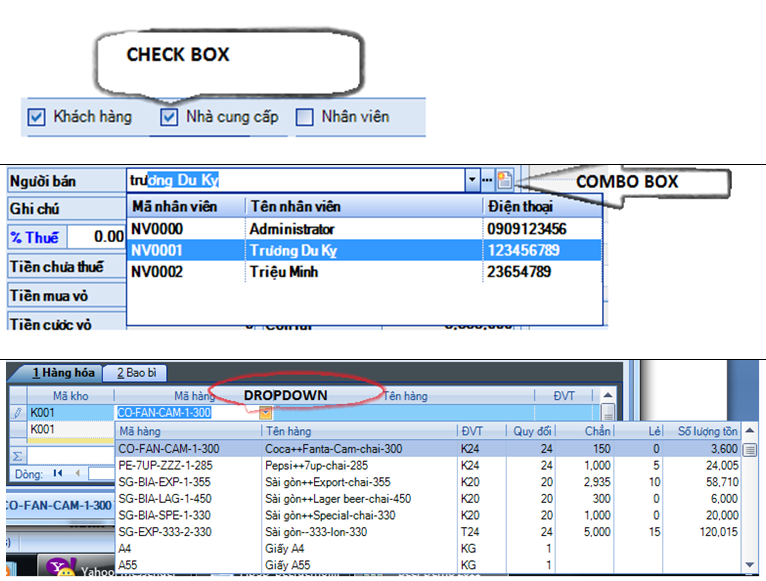
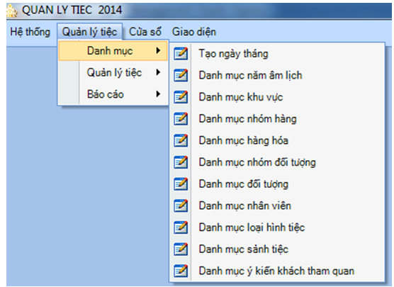
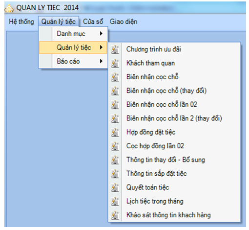
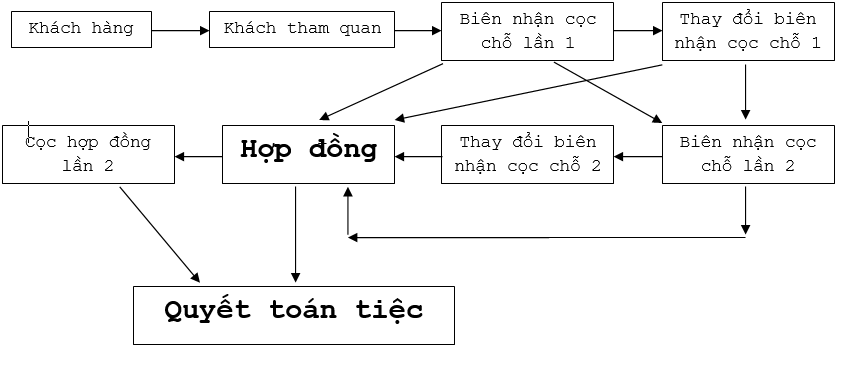
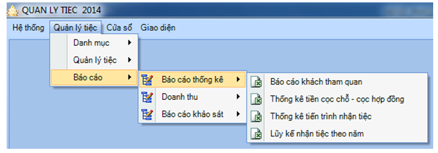
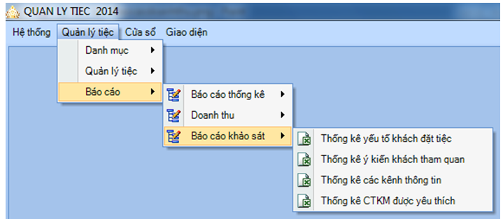

# REQUIREMENT.md — PMQLTiec (Phần mềm Quản lý Tiệc Cưới)
## Tài liệu Yêu cầu Nghiệp vụ (Business Requirements)

---

## I. Tính năng Chung — Áp dụng cho Tất cả Form

### 1.1 Thanh Công cụ Chuẩn (ButtonBar)

Tất cả các form đều có thanh công cụ 6 nút theo thứ tự:

| Nút | Chức năng |
|---|---|
| **Thêm** | Thêm mới dữ liệu |
| **Sửa** | Chọn dòng trong lưới (dòng được chọn highlight xanh) → click Sửa để chỉnh sửa |
| **Xóa** | Chọn dòng cần xóa → click Xóa để xóa |
| **Lọc** | Mặc định phiếu Nhập/Xuất lọc theo **tháng hiện tại**. Click Lọc để mở form lọc theo điều kiện tùy chỉnh. Click Lọc lần nữa để lấy tất cả dữ liệu |
| **In** | Nếu là **Danh mục** → in toàn bộ lưới. Nếu là **Phiếu** → in phiếu theo mẫu |
| **Đóng** | Đóng form |

> [!NOTE]
> Khi click **Sửa** hoặc **Xóa** mà chưa chọn dòng → hiện thông báo yêu cầu chọn dòng trước.

---

### 1.2 Thao tác Bàn phím & Chuột

#### Checkbox
| Thao tác | Hành động |
|---|---|
| Click chuột phải | Đánh dấu / bỏ đánh dấu |
| Phím `Space` | Đánh dấu / bỏ đánh dấu |

#### Combo box
| Thao tác | Hành động |
|---|---|
| Click mũi tên ▼ hoặc `F4` | Mở danh sách chọn |
| Nhập ký tự trực tiếp | Auto-filter danh sách theo ký tự đang nhập |
| Click `...` (3 chấm) hoặc `F3` | Mở form danh sách tra cứu / thêm mới |
| Click icon tờ giấy hoặc `F2` | Mở form thêm mới danh mục |

#### Dropdown
| Thao tác | Hành động |
|---|---|
| Nhập ký tự trực tiếp | Auto-filter danh sách theo ký tự đang nhập |
| Click mũi tên ▼ | Mở danh sách chọn |
| `F2` | Thêm mới (khi chưa có trong danh sách) |
| `F3` | Mở danh sách tra cứu / thêm mới |

---

## II. Menu Hệ Thống

### II.1 Danh sách Người dùng
**Truy cập:** `Hệ Thống > Quản trị hệ thống > Danh sách người dùng`

- Tạo các tài khoản đăng nhập vào phần mềm
- Cột **Thuộc nhóm**: nhóm được phân quyền — có thể phân quyền theo nhóm hoặc riêng lẻ theo user
- Cột **Ngưng sử dụng**: ✅ = user **không thể đăng nhập** vào phần mềm

---

### II.2 Phân quyền Sử dụng
**Truy cập:** `Hệ Thống > Quản trị hệ thống > Phân quyền sử dụng`

**Cách thực hiện:** Click `Thêm sửa nhóm` → click `Chọn nhóm` → phân quyền theo menu hoặc theo từng form

| Quyền | Mô tả |
|---|---|
| **Xem** | Chỉ được xem dữ liệu, không thao tác |
| **Thêm** | Được thêm mới dữ liệu |
| **Sửa** | Được sửa dữ liệu hiện có |
| **Xóa** | Được xóa dữ liệu |

---

### II.3 Khai báo Năm Sử dụng
**Truy cập:** `Hệ Thống > Quản trị hệ thống > Khai báo năm sử dụng`

**Cách thực hiện:**
1. Click `Thêm` → nhập năm cần thêm
2. Click `Thêm` lần nữa → hệ thống **tự tạo Kỳ và Quý** trong năm
3. Click `Lưu` để lưu lại

---

### II.4 Thiết lập Thông số Hệ thống
**Truy cập:** `Hệ Thống > Quản trị hệ thống > Thiết lập thông số hệ thống`

#### Tab Thông tin Công ty
| Cột | Mô tả |
|---|---|
| **Mã** | Không thể sửa |
| **Giá trị** | Sửa tên công ty, địa chỉ, số điện thoại |
| **Giá trị (2)** | Thông tin bổ sung |

> [!NOTE]
> Để thay đổi Logo: vào thư mục `Qplaza\Logo` → thay file ảnh logo đổi tên thành `logo.jpg`

#### Tab Kỳ Sử dụng
- Chọn **Kỳ bắt đầu** và **Kỳ kết thúc** của năm hiện tại
- ⚠️ Không chọn đúng sẽ **không cho lưu** dữ liệu

#### Tab Khác
| Cột | Mô tả |
|---|---|
| **Mã** | Không thể sửa |
| **Code Name** | Tên nghiệp vụ — không sửa |
| **Giá trị** | Chỉ sửa dòng **"Quỹ tiền mặt"** — nhập tiền quỹ hiện tại khi bắt đầu dùng phần mềm |

---

### II.5 Sao lưu Dữ liệu
**Truy cập:** `Hệ Thống > Quản trị hệ thống > Sao lưu dữ liệu`

- Click nút `...` để chọn đường dẫn lưu
- Tên file backup tự động theo format: `[TênDB]_YYYY_MM_DD_HH_mm_ss`

---

### II.6 Hiện Danh sách Báo cáo
**Truy cập:** `Hệ Thống > Hiện danh sách báo cáo`

- Hiện form chứa tất cả các báo cáo
- Mặc định khi mở chương trình sẽ hiện danh sách báo cáo ở bên trái màn hình

---

### II.7 Khóa / Mở Kỳ Sử dụng
**Truy cập:** `Hệ Thống > Khóa mở kỳ sử dụng`

- Dùng để **khóa** hoặc **mở** kỳ sử dụng
- Kỳ bị khóa → **không thể** lập phiếu Nhập/Xuất hay Thu/Chi

---

### II.8 Chọn Kỳ Sử dụng
**Truy cập:** `Hệ Thống > Chọn kỳ sử dụng`

- Chọn kỳ đang làm việc hiện tại

---

### II.9 Đổi Mật khẩu
**Truy cập:** `Hệ Thống > Đổi mật khẩu`

- Đổi mật khẩu đăng nhập của tài khoản hiện tại

---

## III. Menu Danh mục
**Truy cập:** `Quản lý tiệc > Danh mục`

---

### III.1 Danh mục Tạo Ngày tháng

> [!IMPORTANT]
> Phải tạo ngày tháng **trước khi sử dụng** phần mềm. Dùng để tự động sinh ngày Âm lịch khi nhập ngày Dương lịch trong Biên nhận cọc chỗ và Hợp đồng.

**Ví dụ:** Ngày tổ chức `11/01/2014` → tự động hiện `"Nhằm Thứ bảy, Ngày 11 Tháng 12 Năm Quý Tỵ"`

**Cách tạo:**
1. Mở form từ menu Danh mục
2. Click `Tạo ngày tháng` → chọn **Tháng Năm** cần tạo
3. Hệ thống tự tạo các ngày Dương lịch trong tháng
4. Nhập ngày Âm lịch tương ứng cho từng ngày Dương lịch

---

### III.2 Danh mục Năm Âm lịch
- Tạo tên năm theo Can Chi (Ví dụ: 2012 → `Năm Nhâm Thìn`, 2013 → `Quý Tỵ`)

---

### III.3 Danh mục Khu vực
- Khu vực cư trú của khách hàng (VD: Q.1, Q.2, Q.Phú Nhuận...)
- Dùng cho thống kê khách hàng theo khu vực

---

### III.4 Danh mục Nhóm hàng
- Phân loại hàng hoá thành các nhóm:

| Mã | Tên nhóm |
|---|---|
| `DV` | Dịch vụ |
| `HH` | Hàng hoá (Món ăn) |
| `TU` | Thức uống |
| ... | ... |

---

### III.5 Danh mục Hàng hóa
- Liên quan đến: Hợp đồng, Thay đổi–Bổ sung, Quyết toán tiệc

| Field | Mô tả |
|---|---|
| **Mã hàng** | Tự động sinh khi thêm mới |
| **Tên hàng (có dấu)** | Nhập tay |
| **Tên hàng (không dấu)** | Tự động sinh từ tên có dấu |
| **Đơn vị tính** | Chọn từ danh mục |
| **Nhóm hàng** | Phân loại theo nhóm |

#### Giá bán (lịch sử giá)
| Field | Mô tả |
|---|---|
| **Ngày** | Ngày bắt đầu áp dụng giá — **không sửa ngày cũ**, thêm dòng mới khi đổi giá |
| **Đơn giá** | Hệ thống tự lấy đơn giá của **ngày gần nhất** khi chọn mã hàng |

#### Định lượng & Giá vốn
- Món ăn (Hàng hóa) được cấu thành từ các **Nguyên vật liệu** (`dmNguyenvatlieu`).
- **Giá vốn** của món ăn được tính tự động thông qua bảng Định lượng (`dmHanghoadinhluong`), dựa trên tổng chi phí nguyên vật liệu: `Số lượng định lượng × Giá vốn nguyên vật liệu cấu thành`.
- Dùng để tính toán lợi nhuận trong Báo cáo chi phí tiệc.

---

### III.6 Danh mục Đối tượng (Khách hàng)
- Khách đến tham quan: có thể chỉ nhập tên, thêm thông tin đầy đủ sau
- Khi làm **Cọc chỗ**: bắt buộc nhập đầy đủ:

| Field | Ghi chú |
|---|---|
| Tên cô dâu & chú rể | Tên ghép |
| Tên cô dâu | Riêng |
| Tên chú rể | Riêng |
| Điện thoại cô dâu | |
| Điện thoại chú rể | |
| Địa chỉ | |
| Người đại diện | |
| Điện thoại người đại diện | |
| Email | Nếu có |

---

### III.7 Danh mục Ý kiến Khách tham quan
- Nhập các mẫu ý kiến thường gặp để chọn nhanh khi lập phiếu Khách tham quan
- Hỗ trợ báo cáo thống kê ý kiến khách

---

## IV. Menu Quản lý Tiệc

---

### IV.1 Chương trình Ưu đãi
- Định nghĩa các gói ưu đãi (Combo) áp dụng cho khách đặt tiệc
- Điều kiện áp dụng: **Từ ngày → Đến ngày** + **Từ số bàn → Đến số bàn**

---

### IV.2 Khách Tham quan
- Lập phiếu khi khách đến tham quan nhà hàng
- Lưu thông tin, ý kiến và nội dung thoả thuận
- **Hỗ trợ tự động:** Khi khách quay lại đặt cọc → chọn tên khách là thông tin tự điền vào Biên nhận cọc chỗ, không nhập lại

---

### IV.3 Biên nhận Cọc chỗ Lần 1
- Sau khi khách tham quan và quay lại đặt cọc
- Chọn tên khách hàng → thông tin từ phiếu Tham quan tự điền vào (vẫn chỉnh sửa được)

> [!IMPORTANT]
> Khi chọn sảnh: **bắt buộc đánh dấu Sảnh chính** — phòng trường hợp khách đặt nhiều sảnh cùng lúc.

---

### IV.4 Thay đổi Biên nhận Cọc chỗ Lần 1
- Dùng khi khách đã cọc lần 1 (chưa cọc lần 2) mà có thay đổi
- Thông tin thay đổi sẽ được chuyển sang **Biên nhận cọc lần 2** hoặc **Hợp đồng**

---

### IV.5 Biên nhận Cọc chỗ Lần 2
- Dùng khi tiền cọc lần 1 chưa đủ theo yêu cầu
- Tự lấy thông tin từ **Cọc lần 1** hoặc **Thay đổi cọc lần 1**

---

### IV.6 Thay đổi Biên nhận Cọc chỗ Lần 2
- Dùng khi đã cọc lần 2 nhưng chưa làm Hợp đồng mà có thay đổi
- Thông tin thay đổi này được **ưu tiên lấy vào Hợp đồng**

---

### IV.7 Hợp đồng Tiệc

> [!IMPORTANT]
> Số hợp đồng **không được viết có dấu** và không dùng ký tự đặc biệt.

**Dữ liệu tự điền từ Biên nhận cọc chỗ:** Ngày tổ chức, Số bàn mặn/chay, Tổng tiền đã cọc

#### Tab Bàn Tiệc
| Field | Mô tả |
|---|---|
| **Gói cưới (Ưu đãi)** | Chọn gói combo → dữ liệu ưu đãi tự hiện ở Tab Ưu đãi |
| **Giá theo combo** | ✅ = không hiện đơn giá từng món, chỉ hiện tổng tiền thực đơn |
| **Giảm giá %** | Giảm giá trên giá bàn mặn hoặc bàn chay |
| **Số tiền phải đặt cọc** | Hiển thị nhanh số tiền còn thiếu để đủ 40% — **không ảnh hưởng** hợp đồng |

#### Tab Sảnh Tiệc
- Mặc định lấy sảnh từ Biên nhận cọc chỗ, có thể thay đổi nếu chưa bị đặt
- **Bắt buộc đánh dấu Sảnh chính** (kể cả khi chỉ có 1 sảnh)

#### Tab Thực đơn Mặn
| Field | Mô tả |
|---|---|
| Đơn giá món | Chỉ nhập khi **không phải combo** |
| Khai vị đầu giờ | ✅ = món khai vị đầu bữa |
| STT món | Thứ tự hiển thị trong hợp đồng in |
| Ghi chú thực đơn mặn | Hiện trong phần Thông tin sắp đặt tiệc |

#### Tab Thực đơn Chay
- Tương tự Thực đơn Mặn
- Thêm checkbox **Phần** (nếu phần chay đơn lẻ, không tính bàn)

#### Tab Ưu đãi
- Tự điền từ gói cưới đã chọn ở Tab Bàn Tiệc
- Khách muốn thay đổi ưu đãi → nhập vào **Yêu cầu của khách**
- Nếu thay đổi làm tăng chi phí → nhập **Số tiền bù thêm**

#### Tab Thức uống
| Field | Mô tả |
|---|---|
| Khuyến mãi | ✅ = không tính tiền, ❌ = tính tiền |
| IsBan | ✅ = tính giá theo bàn, ❌ = tính theo chai |
| Yêu cầu của khách | Nhập nếu khách muốn đổi thức uống |
| Số tiền bù thêm | Số tiền chênh lệch khi thay đổi |

#### Tab Dịch vụ
- Nhập các dịch vụ bổ sung theo yêu cầu khách

#### Tab Ghi chú
- Phần thoả thuận với khách hàng
- Điều 3, 4, 5 sẽ hiện trong hợp đồng in

#### Tab Setup Print
- Canh chỉnh layout hợp đồng khi in
- Nhập số vào từng cột = số dòng trống chèn thêm tại vị trí đó

#### Tab Dời – Huỷ Hợp đồng
- Xử lý khi khách muốn dời ngày hoặc hủy tiệc

---

### IV.8 Cọc Hợp đồng Lần 2
- Dùng khi tiền cọc hợp đồng chưa đủ 40%

---

### IV.9 Thông tin Thay đổi – Bổ sung
- Dùng sau khi ký hợp đồng mà khách còn thay đổi
- Cách nhập giống Hợp đồng nhưng **chỉ nhập những gì thay đổi**
- Những gì không thay đổi → để trống

---

### IV.10 Thông tin Sắp đặt Tiệc
- Tự lấy dữ liệu từ Hợp đồng
- Ghi nhận **yêu cầu cụ thể của từng bộ phận** khi triển khai tiệc (bếp, lễ tân, âm thanh...)

---

### IV.11 Quyết toán Tiệc
- Thực hiện sau khi tiệc kết thúc (hoạt động như một **Phiếu thu**)
- Lấy dữ liệu từ **Hợp đồng** hoặc **Thông tin Thay đổi – Bổ sung**

#### Tab Bàn Tiệc và Dịch vụ
- Tự lấy dữ liệu khi chọn Hợp đồng
- Có thể thêm bàn/dịch vụ phát sinh tại đây

#### Tab Thức uống
- Lấy danh sách thức uống từ Hợp đồng / Thay đổi–Bổ sung
- Nhập **số lượng thực tế** để hệ thống tính giá trị

#### Tab Phát sinh
- Nhập các dịch vụ, bàn tiệc, phần ăn **phát sinh trong lúc tổ chức**

#### Tab Giảm giá — 3 cách giảm
| Cách | Thao tác |
|---|---|
| **1. Giảm trên tổng** | Nhập vào ô giảm giá phía trên form |
| **2. Giảm giá khác** | Nhập vào Tab Giảm giá |
| **3. Giảm trực tiếp dòng** | Nhập vào cột "Giảm giá" trong từng tab (Bàn, Thức uống...) |

> [!IMPORTANT]
> Sau khi **Lưu Quyết toán**: hợp đồng chuyển trạng thái "Đã quyết toán" → **Sảnh được giải phóng** để nhận tiệc mới.

---

### IV.12 Xem Lịch Tiệc trong Tháng

| Màu / Ký hiệu | Ý nghĩa |
|---|---|
| 🟢 **Xanh** | Mới cọc chỗ, chưa có hợp đồng |
| 🔴 **Đỏ** | Đã ký hợp đồng |
| **Số** trong ô | Số lượng bàn — sảnh chính |
| **X** trong ô | Sảnh phụ |

- **Double-click** vào ô lịch → xem chi tiết Biên nhận cọc chỗ hoặc Hợp đồng

---

### IV.13 Khảo sát Thông tin Khách hàng
- Thực hiện sau khi kết thúc tiệc
- Ghi nhận đánh giá của khách → dùng cho báo cáo thống kê

---

## IV-Phụ. Quy trình Làm Hợp đồng và Quyết toán Tiệc

### 5 Quy trình có thể xảy ra

| Quy trình | Luồng |
|---|---|
| **QT 1** | Tham quan → Cọc 1 → Hợp đồng → [Cọc HĐ 2] → Quyết toán |
| **QT 2** | Tham quan → Cọc 1 → **Thay đổi cọc 1** → Hợp đồng → [Cọc HĐ 2] → Quyết toán |
| **QT 3** | Tham quan → Cọc 1 → **Cọc 2** → Hợp đồng → [Cọc HĐ 2] → Quyết toán |
| **QT 4** | Tham quan → Cọc 1 → Thay đổi cọc 1 → **Cọc 2** → Hợp đồng → [Cọc HĐ 2] → Quyết toán |
| **QT 5** | Tham quan → Cọc 1 → Thay đổi cọc 1 → Cọc 2 → **Thay đổi cọc 2** → Hợp đồng → [Cọc HĐ 2] → Quyết toán |

> `[Cọc HĐ 2]` = tùy chọn, chỉ dùng khi tiền cọc hợp đồng chưa đủ 40%

---

## V. Báo cáo

### V.1 Báo cáo Thống kê

| Báo cáo | Mô tả |
|---|---|
| **Khách tham quan** | Số lượng khách tham quan từ ngày → đến ngày. Điều kiện "Năm" dùng tính tỷ lệ trong năm |
| **Thống kê cọc chỗ – cọc HĐ** | Tiền cọc chỗ và cọc HĐ theo khoảng ngày. Cho biết số bàn tăng/giảm |
| **Tiến trình nhận tiệc** | Tháng/Năm nhận tiệc và Tháng/Năm tổ chức tiệc |
| **Luỹ kế nhận tiệc trong năm** | Số bàn và doanh thu nhận tiệc theo nhân viên Sales theo khoảng ngày |

---

### V.2 Doanh thu
- Báo cáo doanh thu **tổng hợp** và **chi tiết** theo khoảng ngày từ → đến

---

### V.3 Báo cáo Khảo sát

| Báo cáo | Mô tả |
|---|---|
| **Yếu tố khách đặt tiệc** | Các yếu tố dẫn đến quyết định đặt tiệc |
| **Ý kiến khách tham quan** | Tổng hợp tất cả ý kiến khách đã tham quan |
| **Các kênh thông tin** | Kênh nào giúp khách biết đến nhà hàng |
| **CTKM được yêu thích** | Các chương trình khuyến mãi được chọn nhiều nhất |

---

## VI. Yêu cầu Bổ sung (Cập nhật)

### VI.1 Hồ sơ Khách hàng
**Route:** `#/customers`
**Module:** HopDong

- Quản lý danh bạ toàn bộ khách hàng đã/đang đặt tiệc.
- **Tra cứu nhanh** theo tên khách, số điện thoại, mã khách.
- **Lịch sử giao dịch** của từng khách: Đã tham quan bao nhiêu lần, đã ký hợp đồng nào, đã thanh toán chưa.
- Thông tin lưu: Tên Cô Dâu – Chú Rể, SĐT, Địa chỉ, CMND đại diện, Email, Loại tiệc ưa thích, Nhân viên phụ trách.
- **DB mapping:** Bảng `dmkhachhang` (Makh, Tenchure, Tencodau, Dienthoai, Mail, Diachi…).

---

### VI.2 Trạng thái Sảnh Tiệc
**Route:** `#/hall-status`
**Module:** HopDong

- Hiển thị **trực quan bằng màu sắc** tình trạng từng sảnh tiệc trong ngày/tuần/tháng.

| Màu | Trạng thái |
|---|---|
| 🟢 Xanh lá | Sảnh trống – Có thể đặt |
| 🟡 Vàng | Đã cọc chỗ – Chờ ký HĐ |
| 🔴 Đỏ | Đã ký Hợp đồng – Đã có chủ |
| ⚫ Xám | Ngưng hoạt động / Đang bảo trì |

- Click vào từng ô sảnh → Hiển thị thông tin chi tiết (Tên khách, Ngày tổ chức, Ca tiệc, Số bàn).
- **DB mapping:** Bảng `SanhTiec` kết hợp `HopDongTiec`.

---

### VI.3 Nhân viên Phục vụ Tiệc
**Route:** `#/staff`
**Module:** NhanSu

- Quản lý hồ sơ nhân viên phục vụ tiệc (Thời vụ, Bán thời gian, Fulltime).
- Thông tin lưu: Họ tên, Giới tính, SĐT, Loại hợp đồng, Ngày vào làm, Mức lương/ca, Đánh giá.
- Ghi nhận **đánh giá / nhận xét** sau mỗi tiệc (Chuyên cần, Thái độ, Kỹ năng).
- Lịch làm việc theo ca tiệc.

---

### VI.4 Cảnh báo Thời hạn Thanh toán
**Vị trí hiển thị:** Dashboard (`#/dashboard`) — Widget thông báo

- Hiển thị danh sách các hợp đồng **sắp đến hạn thanh toán** (trong vòng 7 ngày tới).
- Cảnh báo màu đỏ khi **đã quá hạn thanh toán**.
- Click vào cảnh báo → Nhảy thẳng vào màn hình Hợp đồng chi tiết.

---

### VI.5 Báo cáo Doanh thu Tiệc
**Route:** `#/report-revenue`
**Module:** BaoCao

- Báo cáo doanh thu **tổng hợp** và **chi tiết** theo khoảng ngày (Từ → Đến).
- Lọc theo: Sảnh tiệc, Nhân viên Sales, Loại tiệc.
- Biểu đồ cột/đường theo tháng trong năm.
- Xuất ra file Excel / In báo cáo.

---

### VI.6 Báo cáo Chi phí Tiệc
**Route:** `#/report-cost`
**Module:** BaoCao

- Báo cáo tổng hợp chi phí: Gói thực đơn, Dịch vụ phát sinh, Chi phí nhân sự ca tiệc.
- So sánh Chi phí ↔ Doanh thu để tính Lợi nhuận gộp theo từng tiệc.

---

### VI.7 Báo cáo Quản lý Khác
**Route:** `#/report-other`
**Module:** BaoCao

Bao gồm các báo cáo quản trị tổng hợp:

| Báo cáo | Mô tả |
|---|---|
| **Tiến trình nhận tiệc** | Tháng/Năm nhận tiệc và Tháng/Năm tổ chức tiệc |
| **Luỹ kế nhận tiệc trong năm** | Số bàn và doanh thu theo nhân viên Sales |
| **Thống kê cọc chỗ – cọc HĐ** | Tiền cọc và số bàn tăng/giảm theo khoảng ngày |
| **Yếu tố khách đặt tiệc** | Lý do khách lựa chọn nhà hàng |
| **Trạng thái sảnh CrossTab** | Lưới chéo sảnh × ngày tổ chức (nguồn: `CrosstabDatsanh_Sumkhach`) |

---

### VI.8 Quản lý Kho & Kế toán cơ bản
**Module:** Kho / KeToan

- Tuân thủ nguyên tắc Khóa/Mở kỳ sử dụng: **Không thể** lập phiếu khi kỳ đã khóa.
- **Phiếu Nhập / Xuất kho:** Quản lý xuất nhập hàng hóa, mặc định lọc dữ liệu theo tháng hiện tại.
- **Phiếu Thu / Chi:** Quản lý "Quỹ tiền mặt" và thu chi liên quan đến nghiệp vụ (VD: Quyết toán tiệc sinh ra Phiếu thu).

---

## VII. Bảng Tổng hợp Route & Trạng thái

| Route | Tên Màn hình | Module | Trạng thái |
|---|---|---|---|
| `#/dashboard` | Tổng quan | QuanTriHeThong | ✅ Có giao diện mẫu |
| `#/users` | Người dùng | QuanTriHeThong | ✅ Có giao diện mẫu |
| `#/customers` | Hồ sơ Khách hàng | HopDong | ✅ Có giao diện mẫu |
| `#/calendar` | Lịch tiệc | HopDong | ✅ Có giao diện mẫu |
| `#/hall-status` | Trạng thái Sảnh | HopDong | ✅ Có giao diện mẫu |
| `#/visitor` | Khách tham quan | HopDong | ✅ Đã có Form đầy đủ |
| `#/booking` | Biên nhận cọc | HopDong | ✅ Đã có Form đầy đủ |
| `#/contract` | Hợp đồng tiệc | HopDong | ✅ Có giao diện mẫu |
| `#/checkout` | Quyết toán | QuyetToan | ✅ Có giao diện mẫu |
| `#/staff` | Nhân viên phục vụ | NhanSu | ✅ Có giao diện mẫu |
| `#/menu-items` | Hàng hóa / Món ăn | DanhMuc | ✅ Có giao diện mẫu |
| `#/report-revenue` | Doanh thu Tiệc | BaoCao | ✅ Có giao diện mẫu |
| `#/report-cost` | Chi phí Tiệc | BaoCao | ✅ Có giao diện mẫu |
| `#/report-other` | Báo cáo Khác | BaoCao | ✅ Có giao diện mẫu |
| `#/inventory` | Phiếu Nhập / Xuất kho | Kho | ⏳ Theo thiết kế gốc |
| `#/cash-flow` | Phiếu Thu / Chi | KeToan | ⏳ Theo thiết kế gốc |
